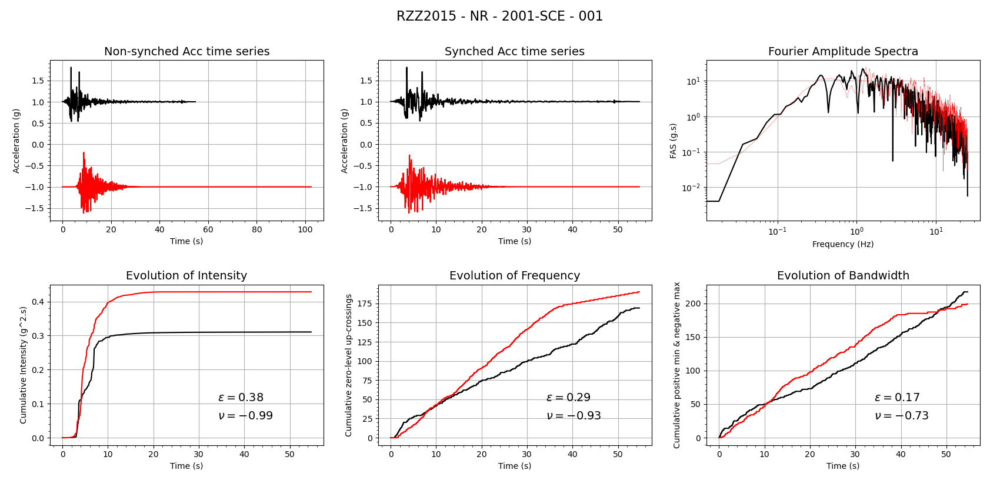

The GMSV Toolkit includes several tools from the Broadband Platform that can be used for metrics computation. Each tool supports both a command-line interface for individual file processing and programmatic integration via a Python API.

## rotdxx.py

The rotdxx.py script processes two perpendicular horizontal components of a ground motion acceleration seismogram (e.g., North-South and East-West) and computes the Pseudo-Spectral Acceleration (PSA). Users can select RotD50 and/or RotD100 as the output.

The following command-line options are available:

```
usage: rotdxx.py [-h] [--input-dir INPUT_DIR] [--output-dir OUTPUT_DIR] [-i INPUT_FILE] [-o OUTPUT_FILE]
                 [--batch-file BATCH_FILE] [--station-list STATION_LIST] [--input-suffix INPUT_SUFFIX]
                 [--vertical] [--rotd100] [--rotd50] [-q]

Compute RotDXX for one or more seismograms.

options:
  -h, --help            show this help message and exit
  --input-dir INPUT_DIR
                        input directory
  --output-dir OUTPUT_DIR
                        output directory
  -i, --input, --input-file INPUT_FILE
                        input acceleration BBP file
  -o, --output, --output-file OUTPUT_FILE
                        output rd50/rd100 file
  --batch-file, -b BATCH_FILE
                        file with list of timeseries to process
  --station-list, -s STATION_LIST
                        station list for batch processing
  --input-suffix, --suffix INPUT_SUFFIX
                        suffix used for input files
  --vertical, -v        process vertical component instead of horizontals
  --rotd100             enable RotD100 output
  --rotd50              enable RotD50 output (default)
  -q, --quiet           runs in quiet mode, only print error messages
```

The 'rotdxx.py' module can process 

Here is an example for calling the 'rotdxx.py' module from the command-line:

```bash
$ rotdxx.py --station-list nr_v19_06_2.stl --input-dir bbp_results --output-dir sims_processed
```

The command above will calculate RotD50 (default mode) for each acceleration timeseries in the station list. The module will look for the acceleration files in the 'bbp_results' folder and will output the '.rd50' files in the 'sims_processed' folder.

Here is how to do the same thing using the Python API:

```python
# Import rotdxx module
from metrics import rotdxx
rotdxx_obj = rotdxx.RotDXX(mode="rotd50")

# Call run_station_mode, which will process the
# entire station list file
rotdxx_obj.run_station_mode("nr_v19_06_2.stl", "bbp_results", "sims_processed", verbose=True)
```

Per-station results from the 'rotdxx.py' module can be plotted using the 'plot_rotdxx.py' module in the [plots package](./Plotting). Results can also be aggregated using the 'psa_gof.py' module in the [stats package](./Statistics-Computation), and used to generate a PSA Goodness-of-Fit plot, as described in the [PSA and FAS Workflows page](./PSA-and-FAS-Workflows).

## fas.py

The fas.py script computes the Fourier Amplitude Spectrum (FAS) from ground motion acceleration timeseries datasets to validate simulated seismograms against recorded observations. 

The following command-line options are available:

```
usage: fas.py [-h] --station-list STATION_LIST [--output-dir OUTPUT_DIR] [--logfile LOGFILE] --labels LABELS
              [--input-unit INPUT_UNIT] [--output-unit OUTPUT_UNIT] [--fas-only] [--seas-only] [-q]
              [input_dirs ...]

Compute FAS for a set of seismograms.

positional arguments:
  input_dirs

options:
  -h, --help            show this help message and exit
  --station-list, -s STATION_LIST
                        station list for batch processing
  --output-dir OUTPUT_DIR
                        output directory
  --logfile LOGFILE     file to store processing log messages
  --labels, -l LABELS   comma-separated comparison labels
  --input-unit INPUT_UNIT
                        input units: (g or cm/s/s)
  --output-unit OUTPUT_UNIT
                        output units: (g or cm/s/s)
  --fas-only            outputs only the FAS/EAS file, default is both FAS/EAS and SEAS files
  --seas-only           outputs only the SEAS file, default is both FAS/EAS and SEAS files
  -q, --quiet           runs in quiet mode, only print error messages
```

Users can specify one or more sets of input files at a time using the '--labels' flag and a matching number of 'input_dirs'. The default units is set to 'cm/s/s', but can be changed to 'g' by using the corresponding flags. Additionally, by default, the module computed both FAS/EAS and SEAS for each of the timeseries. This behavior can be changed using the command-line options above. 

Here is an example on how to run this module from the command-line:

```bash
$ fas.py --station-list nr_v19_06_2.stl --output-dir fas_output --labels 2354660,obs bbp_results obs_data
```

In the example above, the 'fas.py' module will calculate FAS, EAS, and Smoothed EAS (SEAS) for each of the stations in the provided station list. The user specified two sets of timeseries, labeled '2354660' and 'obs', and a corresponding set of two input folder where the acceleration timeseries for these two data sets are located.

Here is how to do the same thing using the Python API:

```python
# Import the fas module
from metrics import fas
fas_obj = fas.FAS()

fas_input_dirs = ["bbp_results", "obs_data"]
fas_labels = ["2354660", "obs"]
output_dir = "fas_output"

# Call the run_fas_seas method to calculate FAS
# for all stations in the station list, we provide
# a set of labels and corresponding input folders
fas_obj.run_fas_seas("nr_v19_06_2.stl", fas_input_dirs, fas_labels, output_dir, verbose=True)
```

Per-station results from the 'fas.py' module can be plotted using the 'plot_fas.py' module, and can be compared against other data with the 'plot_fas_comparison.py' module, both in the [plots package](./Plotting). Results can also be aggregated using the 'fas_eas_gof.py' and 'fas_seas_gof.py' modules, available in the [stats package](./Statistics-Computation), and used to generate FAS Goodness-of-Fit plots, as described in the [PSA and FAS Workflows page](./PSA-and-FAS-Workflows).

## rzz2015.py

The rzz2015.py module implements the ground motion validation methodology introduced by Rezaeian, Zhong, Hartzell, and Zareian (2015). The code calculates a suite of time-domain intensity, duration, and evolutionary frequency-content metrics (referred to collectively as the RZZ vector) to evaluate whether simulated earthquake ground motions match key nonstationary features of observed seismograms. The module provides both a command-line interface (CLI) for batch/automated processing and Python API functions for integration into validation pipelines.

The following command-line options are available:

```
usage: rzz2015.py [-h] [--output-dir OUTPUT_DIR] --output-file OUTPUT_FILE --station-list STATION_LIST
                  --sims-dir SIMS_DIR --obs-dir OBS_DIR [--plot-prefix PLOT_PREFIX] --comp-label COMP_LABEL [-q]

Calculates the Rezaeian-Zhong-Zareian 2015 validation metrics.

options:
  -h, --help            show this help message and exit
  --output-dir OUTPUT_DIR
                        output directory
  --output-file OUTPUT_FILE
                        output file
  --station-list, -s STATION_LIST
                        station list
  --sims-dir SIMS_DIR   input directory with simulation data
  --obs-dir OBS_DIR     input directory with observed data
  --plot-prefix PLOT_PREFIX
                        prefix used for each plot
  --comp-label COMP_LABEL
                        comparison label used in plots
  -q, --quiet           runs in quiet mode, only print error messages
  ```

The module will loop through the stations included in the STATION_LIST and look for acceleration seismograms (in cm/s/s) in both SIMS_DIR and OBS_DIR. It will calculate the RZZ metrics and create two plot for each station (one for each horizontal component) using PLOT_PREFIX and COMP_LABEL provided by the user.

As an example, users can call the rzz2015.py module:

```bash
$ rzz2015.py --comp-label NR --station-list nr_v19_06_2.stl --sims-dir bbp_results --obs-dir obs_data  --output-dir rzz2015_output --output-file rzz2015.NR.txt
```

The command above will create a comparison for each station in the station list for the simulated data in the 'bbp_results' folder against the recorded data in the 'obs_data' folder. Plots will be generated in the 'rzz2015_output' folder with the 'NR' comparison label. The 'rzz2015.NR.txt' output file is a csv file containing the RZZ results for all stations.

Here is how to do the same thing using the Python API:

```python
# Import rzz2015 module
from metrics import rzz2015
rzz2015_obj = rzz2015.RZZ2015()

# Call the run_rzz2015 method to generate the
# RZZ2015 metrics for all stations in the provided
# station list file
rzz2015_obj.run_rzz2015("nr_v19_06_2.stl", "NR", "bbp_results", "obs_data", "rzz2015_output/rzz2015.NR.txt", verbose=True)
```

A sample plot is shown below.



  ## calc_gmpe.py

This module can be used to compute GMMs from a set of models (NGA-West1, NGA-West2, or CENA1) at a set of stations. The code uses the earthquake described in the src file.

The following command-line options are available:

  ```
  usage: calc_gmpe.py [-h] [--output-dir OUTPUT_DIR] --gmpe-group GMPE_GROUP --station-list STATION_LIST
                    --src-file SRC_FILE [-q]

Calculate GMPEs for a set of stations.

options:
  -h, --help            show this help message and exit
  --output-dir OUTPUT_DIR
                        output directory
  --gmpe-group GMPE_GROUP
                        GMPE group ['nga-west1', 'nga-west2', 'cena group 1']
  --station-list, -s STATION_LIST
                        station list for batch processing
  --src-file, --src SRC_FILE
                        source description file (SRC file)
  -q, --quiet           runs in quiet mode, only print error messages
  ```

Below is an example on how to call the 'calc_gmpe.py' code:

```bash
$ calc_gmpe.py --gmpe-group nga-west2 --output-dir gmpe_output --src-file nr_v20_07_1.src --station-list nr_v19_06_2.stl
```

The command above will calculate the GMM from the 'NGA-West 2' set and will create an output '.ri50' file for each station in the station list containing the GMPE values for each of the models calculated at 63 different periods ranging from 0.01s to 10s. Here's a fragment showing what a '.ri50' looks like:

```
#station: 2001-SCE
#period ASK BSSA CB CY
0.0100  0.460728        0.539691        0.494158        0.540223
0.0110  0.461000        0.539239        0.496663        0.541927
0.0120  0.461249        0.538827        0.498961        0.543487
0.0130  0.461478        0.538448        0.501084        0.544925
0.0150  0.461888        0.537770        0.504902        0.547507
0.0170  0.462246        0.537179        0.508266        0.549775
0.0200  0.462712        0.536412        0.512667        0.552735
...
```

Here is how to do the same using the Python API:

```python
# Import the calc_gmpe module
from metrics import calc_gmpe
calc_gmpe_obj = calc_gmpe.CalculateGMPE()

# Set up inputs
station_file = "nr_v19_06_2.stl"
src_file = "nr_v20_07_1.src"
gmpe_group = "nga-west2"
output_dir = "gmpe_output"

# Call the run station_mode method to calculate
# GMPE values for all locations from our station list
calc_gmpe_obj.run_station_mode(station_file, src_file, gmpe_group, output_dir, verbose=True)
```

Per-station results from the 'calc_gmpe.py' module can be plotted using the 'plot_gmpe.py' module in the [plots package](./Plotting). Results can also be aggregated using the 'gmpe_gof.py' module in the [stats package](./Statistics-Computation), and used to generate a PSA GMPE Goodness-of-Fit plot.

  # References

  * Rezaeian, S., Zhong, P., Hartzell, S., & Zareian, F. (2015). Validation of simulated earthquake ground motions based on evolution of intensity and frequency content. Bulletin of the Seismological Society of America, 105(6), 3036-3049.