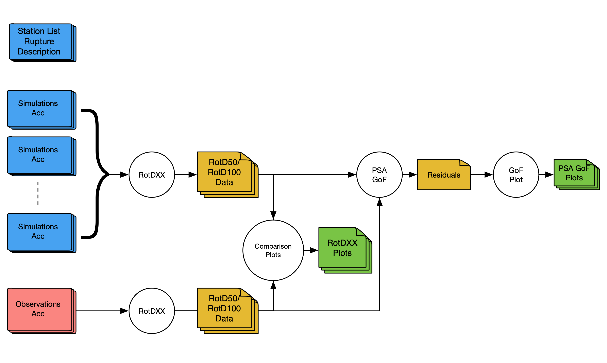
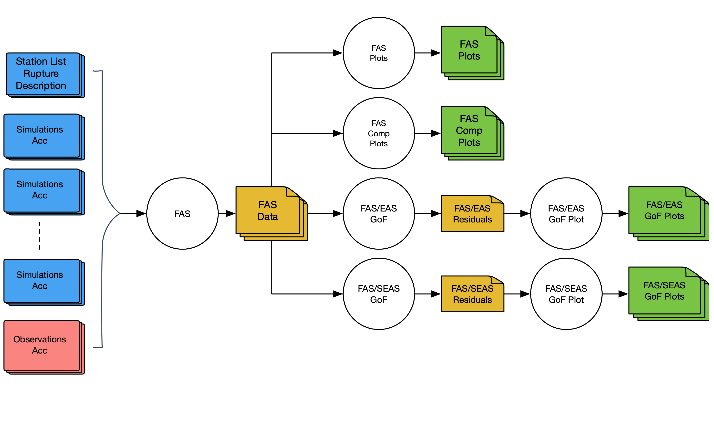

In this page we briefly talk about how modules in the GMSV Toolkit can be used to set up both PSA and FAS processing workflows. Several of the codes available in the GMSV Toolkit have been used in the post-processing stages of the Broadband Platform for more than ten years, and have been modified and migrated to the GMSV Toolkit repository for working as a standalone package. This enables users to take advantage of these codes outside of the Broadband Platform.

The codes included in the GMSV Toolkit package are designed to work independently and can be used separately. Each module includes a command-line interface that allows it to be used from the command-line or automated with a script. Additionally, users can import each module into their Python programs and use the tools directly by calling the functions they need. In this notebook we will focus on using the codes via the Python interface.

# PSA Workflow

As a brief summary, in the PSA GoF workflow, acceleration timeseries go through the RotDXX module where RotD50 is computed at 63 periods ranging from 0.01s to 10s. This output can be compared station by station with the plot_rotdxx module. These RotD50 files can also be aggregated across all stations and compared against a second data set with the PSA GoF tool. Finally, the PSA GoF Plot module can be used to generate different PSA GoF plots so users can see how two datasets match. Please note that the workflow above can work with simulations versus observed data, as well as with two sets of simulated data.

The diagram below illustrates the processing steps involved in the PSA processing workflow:

# FAS Workflow

In the FAS GoF workflow, acceleration timeseries go through the FAS module where fourier amplitude spectra is computed for frequencies between 0.01 and 100Hz. The code outputs two files for each station. The first file contains 4 columns: frequency, the calculated FAS value for the two horizontal components, and the EAS (effective amplitude spectra) value that combines the two horizontal FAS values. The second file contains only two columns: frequency, and the SEAS (smoothed effective amplitude spectra). The output files can be plotted using the plot_fas module and/or compared on a station by station basis with the plot_fas_comparison module. These FAS files can also be aggregated across all stations and compared against a second data set with two FAS GoF tools (one for FAS/EAS and the other for the SEAS). Finally, the FAS GoF Plot modules can be used to generate two FAS GoF plot so users can see how two datasets match. Please note that the workflow above can work with simulations versus observed data, as well as with two sets of simulated data.

The diagram below illustrates the processing steps involved in the FAS processing workflow:

