The GMSV Toolkit includes a number of plotting utilities from the Broadband Platform that can be used with [Metrics Calculation](./Metrics-Calculation.md) and [Statistics Computation](./Statistics-Computation.md) tools. In this page, we show examples on how to run each of the plotting tools, along with sample outputs.

# Basic Plots

## plot_map.py

The plot_map.py module can be used to generate a plot with the earthquake rupture along with the station locations. Users provide a station list and source description files (both described in the [File Format Guide](./File-Format-Guide.md)).

Here are the available command-line options:

```
usage: plot_map.py [-h] [--input-dir INPUT_DIR] [--output-dir OUTPUT_DIR] [--src-file SRC_FILE]
                   [--station-list STATION_LIST] [--output-file OUTPUT_FILE] [--plot-title PLOT_TITLE] [-q]

Generates station map plot.

options:
  -h, --help            show this help message and exit
  --input-dir INPUT_DIR
                        input directory
  --output-dir OUTPUT_DIR
                        output directory
  --src-file, --src SRC_FILE
                        source description file (SRC or SRF file)
  --station-list, -s STATION_LIST
                        station list
  --output-file OUTPUT_FILE
                        output filename for station map plot
  --plot-title, --title PLOT_TITLE
                        set plot title
  -q, --quiet           runs in quiet mode, only print error messages
  ```

In the command below, we provide both a station list and a source description. We also specify the plot title we want and where the output should go.

```bash
$ plot_map.py --src-file nr_v20_07_1.src --station-list nr_v19_06_2.stl --plot-title "Northridge Fault Trace with all Stations" --output-dir output_data --output-file map_all_stations.png
```

The following Python code can be used to produce the same plot:

```python
# Import plot_map module
from plots.plot_map import plot_map

# Set up inputs
plot_title = "Northridge Fault Trace with all Stations"
output_file = "map_all_stations.png"
output_dir = "output_data"
station_file = "nr_v19_06_2.stl"
src_file = "nr_v20_07_1.src"

# Call plot_map module
plot_map(station_file, src_file, plot_title, output_dir, output_file=output_file, verbose=True)
```

The resulting map is shown in the figure below:

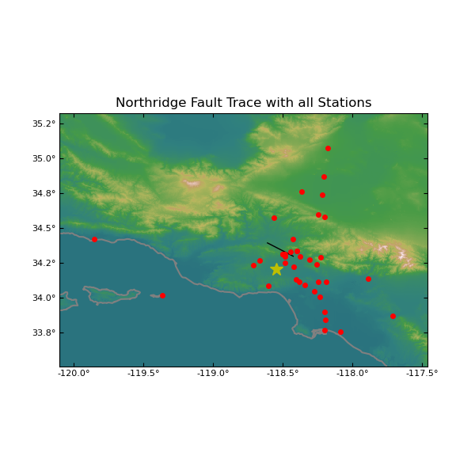

## plot_seismograms.py

The plot_seismograms.py module can be used to generate plots of 3 (or 2) component timeseries. Users can plot a single timeseries, or create a timeseries comparison by specifying multiple input files and labels. The code supports genrating acceleration, velocity and displacement plots, and users can specify the plotting range using various command-line options.

Here are the available command-line options:

```
usage: plot_seismograms.py [-h] [--input-dir INPUT_DIR] [--output-dir OUTPUT_DIR] [-o OUTPUT_FILE]
                           [--batch-file BATCH_FILE] [--station-id STATION_ID] [--station-list STATION_LIST]
                           [--labels LABELS] [--comp-label COMP_LABEL] [-2] [--acc] [--vel] [--dis] [--all]
                           [--xmin XMIN] [--xmax XMAX] [-m PLOT_MODE] [-dur PLOT_DURATION]
                           [--orientation ORIENTATIONS] [--plot-title PLOT_TITLE] [-q]
                           [input_files ...]

Plot seismogram comparison of two or more timeseries.

positional arguments:
  input_files

options:
  -h, --help            show this help message and exit
  --input-dir INPUT_DIR
                        input directory
  --output-dir OUTPUT_DIR
                        output directory
  -o, --output, --output-file OUTPUT_FILE
                        output plot file
  --batch-file, -b BATCH_FILE
                        file with list of timeseries to process
  --station-id, -id STATION_ID
                        station id for comparison
  --station-list, -s STATION_LIST
                        station list for batch processing
  --labels, -l LABELS   comma-separated comparison labels
  --comp-label COMP_LABEL
                        comparison label used for the output file prefix
  -2, --two, --two-component
                        select two component comparison (default 3-component)
  --acc, --acceleration
                        plot acceleration comparison
  --vel, --velocity     plot velocity comparison
  --dis, --displacement
                        plot displacement comparison
  --all                 plot acceleration/velocity/displacement comparisons
  --xmin XMIN           xmin to plot
  --xmax XMAX           xmax to plot
  -m, --mode PLOT_MODE  plot mode: 1 plots [duration] starting at 0, 2 plots entire seismogram
  -dur, --duration PLOT_DURATION
                        seismogram duration to plot, default is 100s
  --orientation ORIENTATIONS
                        orientation for the 2 or 3 components, default: 0.0, 90.0, UP
  --plot-title, --title PLOT_TITLE
                        plot title
  -q, --quiet           runs in quiet mode, only print error messages
```

We can use the plot_seismograms.py module to generate a timeseries comparison plot by specifying multiple inputs. For each input file users need to provide a corresponding label. When running the tool with a single station, users should provide the station id to be used. Here is an example:

```bash
$ plot_seismograms.py --xmin 0 --xmax 40 --labels Sim,Obs sims_processed/2354660.2001-SCE.acc.bbp obs_proessed/2001-SCE.acc.bbp --station-id 2001-SCE --output-file output_data/2354660.2001-SCE_seis.png
```

The Python code below can be used to generate the same output:

```python
# Import the plot_seismograms module
from plots.plot_seismograms import PlotSeismograms

# Create plotting object, we want to plot 3 components
plot_seism_obj = PlotSeismograms(n_comp=3)

# Pick station
station_name = "2001-SCE"

# Select plotting range 0-40 seconds
xmin = 0.0
xmax = 40.0

# Pick a plot title and set the output file
plot_title = "Seismogram comparison for station %s"  % (station_name)

# Input files and labels
sim_file = "2354660.2001-SCE.acc.bbp"
obs_file = "2001-SCE.acc.bbp"
input_files = [sim_file, obs_file]
labels = ["Sim", "Obs"]

output_plot = "output_data/2354660.2001-SCE_seis.png"

# Generate plot
plot_seism_obj.plot_single_station(input_files, labels, output_plot, station_name, xmin, xmax, plot_title=plot_title, verbose=True)
```

The comparison plot is shown in the figure below:

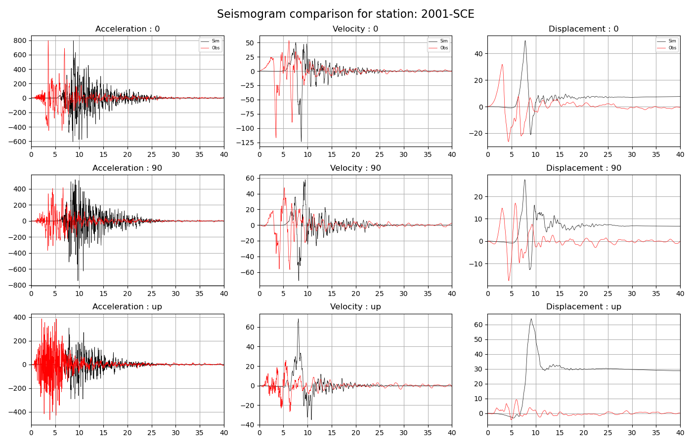

# Plotting Metrics

## plot_rotdxx.py

The plot_rotdxx.py module generates per-station pseudo-spectral acceleration (PSA) comparison plots using orientation-independent ground motion intensity measures—primarily RotD50 and RotD100—calculated across 63 periods ranging from 0.01s to 10s.

It provides visual comparison between simulated ground motions and observed/reference data or between multiple simulation models on a single station basis.

Here are the available command-line options:

```
usage: plot_rotdxx.py [-h] [--input-dir INPUT_DIR] [--output-dir OUTPUT_DIR] [-o OUTPUT_FILE]
                      [--batch-file BATCH_FILE] [--station-id STATION_ID] [--station-list STATION_LIST]
                      [--labels LABELS] [--comp-label COMP_LABEL] [--rotd100] [--rotd50] [--low-freq LFREQ]
                      [--high-freq HFREQ] [-q]
                      [input_files ...]

Plot RotD50/RotD100 comparison of two or more files.

positional arguments:
  input_files

options:
  -h, --help            show this help message and exit
  --input-dir INPUT_DIR
                        input directory
  --output-dir OUTPUT_DIR
                        output directory
  -o, --output, --output-file OUTPUT_FILE
                        output rd100 file
  --batch-file, -b BATCH_FILE
                        file with list of timeseries to process
  --station-id, -id STATION_ID
                        station id for comparison
  --station-list, -s STATION_LIST
                        station list for batch processing
  --labels, -l LABELS   comma-separated comparison labels
  --comp-label COMP_LABEL
                        comparison label used for the output file prefix
  --rotd100             select RotD100 comparison
  --rotd50              select RotD50 comparison (default)
  --low-freq, --lf LFREQ
                        adds vertical line at this low frequency corner
  --high-freq, --hf HFREQ
                        adds vertical line at this high frequency corner
  -q, --quiet           runs in quiet mode, only print error messages
```

To generate a plot for a single station, users just specify the station id, the input RotD50 file, and optionally, the output file. If no output file is provided, the code will use <COMP_LABEL>_<STATION_ID>_<MODE>.png, (where mode is either 'rotd50' or 'rotd100'). Here's an example:

```bash
$ plot_rotdxx.py --station-id 2001-SCE --labels obs  --output-dir output_data 2001-SCE.rd50
```

The Python code below does the same thing:

```python
# Import plot_rotdxx module
import os
from plots import plot_rotdxx
plot_rotdxx_obj = plot_rotdxx.PlotRotDXX(mode="rotd50")

# Set up inputs
station_name = "2001-SCE"
input_files = ["2001-SCE.rd50"]
output_dir = "output_data"
labels = ["obs"]

output_file = os.path.join(output_dir, "2001-SCE_rotd50.png")

# Generate RotD50 plot
plot_rotdxx_obj.plot_single_station(input_files, labels, output_file, station_name, verbose=True)
```

And the command below can be used to generate per-station comparison plots of RotD50 results. For plotting multiple datasets, users should specify a number of input folders and a corresponding number of labels to use. The module will create one comparison plot for each station in the station list.

```bash
$ plot_rotdxx.py --station-list nr_v19_06_2.stl --comp-label NR_2354660 --labels NR,2354660 --output-dir output_data obs_processed sims_processed
```

The Python API code for this is shown below:

```python
# Import plot_rotdxx module
import os
from plots import plot_rotdxx
plot_rotdxx_obj = plot_rotdxx.PlotRotDXX(mode="rotd50")

# Set up inputs
station_name = "nr_v19_06_2.stl"
input_dirs = ["obs_processed", "sims_processed"]
labels = ["NR", "2354600"]
output_dir = "output_data"
comp_label = "NR_2354660"

# Call the plotting code
plot_rotdxx_obj.plot_station_mode(station_file, input_dirs, labels, output_dir, comp_label, verbose=True)
```

The figure below shows the plot for one of the stations:

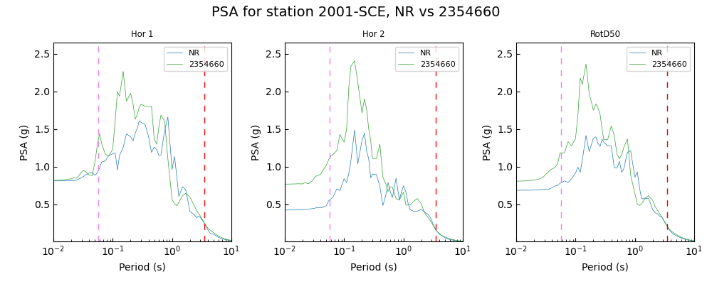

## plot_fas.py

The plot_fas.py module in the SCEC GMSV Toolkit generates Fourier Amplitude Spectra (FAS) plots. It renders individual horizontal components along with the Smoothed Effective Amplitude Spectra (SEAS) for ground motion time series.

Here are the available command-line options:

```
usage: plot_fas.py [-h] [--input-dir INPUT_DIR] [--output-dir OUTPUT_DIR] [-o OUTPUT_FILE]
                   [--batch-file BATCH_FILE] [--station-id STATION_ID] [--station-list STATION_LIST]
                   [--plot-title PLOT_TITLE] [--input-fas-file INPUT_FAS_FILE]
                   [--input-seas-file INPUT_SEAS_FILE] [--comp-label COMP_LABEL] [--units UNITS] [-q]

Plot FAS

options:
  -h, --help            show this help message and exit
  --input-dir INPUT_DIR
                        input directory
  --output-dir OUTPUT_DIR
                        output directory
  -o, --output, --output-file OUTPUT_FILE
                        output plot file
  --batch-file, -b BATCH_FILE
                        file with list of timeseries to process
  --station-id, -id STATION_ID
                        station id
  --station-list, -s STATION_LIST
                        station list for batch processing
  --plot-title, --title PLOT_TITLE
                        plot title
  --input-fas-file INPUT_FAS_FILE
                        input eas file
  --input-seas-file INPUT_SEAS_FILE
                        input seas file
  --comp-label COMP_LABEL
                        comparison label used for the output file prefix
  --units UNITS         units, g or cm/s/s (default)
  -q, --quiet           runs in quiet mode, only print error messages
```

To generate a FAS plot for a single station, users need to specify a station id, and an input file that contains FAS data (see the [File Format Guide](./File-Format-Guide.md) for more details). To generate plots for multiple stations, users can instead provide a station list (or batch file), and an input folder where the FAS data can be found. The command below shows how to generate FAS plots for all stations in a list:

```bash
$ plot_fas.py --station-list nr_v19_06_2.stl --output-dir output_data --input-dir input_data --comp-label 2354660
```

And below is how to generate the same plots using the Python API:

```python
# Import plot_fas module
from plots import plot_fas

# Set up inputs
station_file = "nr_v19_06_2.stl"
comp_label = "2354660"
input_dir = "input_data"
output_dir = "output_data"

# Generate the FAS plots
plot_fas.plot_station_list_mode(station_file, input_dir, output_dir, comp_label=comp_label, verbose=True)
```

And the figure below shows one of the plots produced by the command above:

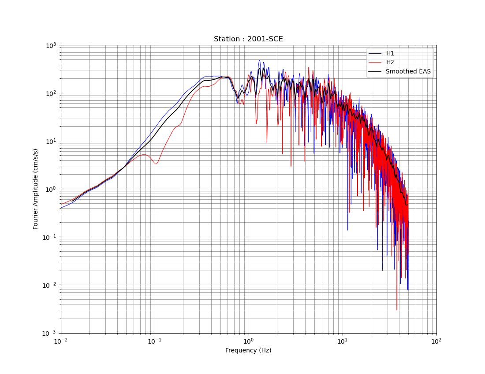

## plot_seas.py

The plot_seas.py module can be used to plot Smoothed Effective Amplitude Sprectra (SEAS) data generated by the fas.py module in the [metrics package](./Metrics-Calculation.md).

Here are the available command-line options:

```
usage: plot_seas.py [-h] [--input-dir INPUT_DIR] [--output-dir OUTPUT_DIR] [-o OUTPUT_FILE]
                    [--batch-file BATCH_FILE] [--station-id STATION_ID] [--station-list STATION_LIST]
                    [--plot-title PLOT_TITLE] [--input-seas-file INPUT_SEAS_FILE] [--comp-label COMP_LABEL]
                    [--units UNITS] [-q]

Plot SEAS

options:
  -h, --help            show this help message and exit
  --input-dir INPUT_DIR
                        input directory
  --output-dir OUTPUT_DIR
                        output directory
  -o, --output, --output-file OUTPUT_FILE
                        output plot file
  --batch-file, -b BATCH_FILE
                        file with list of timeseries to process
  --station-id, -id STATION_ID
                        station id
  --station-list, -s STATION_LIST
                        station list for batch processing
  --plot-title, --title PLOT_TITLE
                        plot title
  --input-seas-file INPUT_SEAS_FILE
                        input seas file
  --comp-label COMP_LABEL
                        comparison label used for the output file prefix
  --units UNITS         units, g or cm/s/s (default)
  -q, --quiet           runs in quiet mode, only print error messages
```

To generate a SEAS plot for a single station, users need to specify a station id, and an input file that contains SEAS data (see the [File Format Guide](./File-Format-Guide.md) for more details). To generate plots for multiple stations, users can instead provide a station list (or batch file), and an input folder where the SEAS data can be found. The command below shows how to generate a single station SEAS plot:

```bash
$ plot_seas.py --station-id 2001-SCE --output-dir output_data --comp-label 2354660 --input-seas-file 2354660.2001-SCE.seas.fs.col --input-dir input_data
```

And below is how to generate the same plot using the Python API:

```python
# Import the plot_seas module
import os
from plots import plot_seas

# Set up inputs
station_id = "2001-SCE"
input_dir = "input_data"
output_dir = "output_data"
input_file = os.path.join(input_dir, "2354660.2001-SCE.seas.fs.col")
output_file = os.path.join(output_dir, "2354660.2001-SCE.seas.png")

# Generate plot
plot_seas.plot_seas_single_station(station_id, output_file, input_seas_file=input_file, verbose=True)
```

And the figure below shows the results:

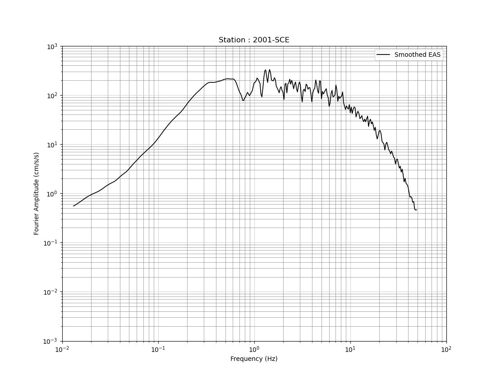

## plot_fas_comparison.py

The plot_fas_comparison.py module is designed to plot and compare Fourier Amplitude Spectra (FAS) and Smoothed Effective Amplitude Spectra (SEAS) derived from simulated ground motions against observed records.

Here are the available command-line options:

```
usage: plot_fas_comparison.py [-h] [--input-dir INPUT_DIR] [--output-dir OUTPUT_DIR] [-o OUTPUT_FILE]
                              [--batch-file BATCH_FILE] [--station-id STATION_ID] [--station-list STATION_LIST]
                              [--plot-title PLOT_TITLE] [--low-freq LFREQ] [--high-freq HFREQ]
                              [--input-fas-file1 INPUT_FAS_FILE1] [--input-seas-file1 INPUT_SEAS_FILE1]
                              [--input-fas-file2 INPUT_FAS_FILE2] [--input-seas-file2 INPUT_SEAS_FILE2]
                              [--labels LABELS] [--comp-label COMP_LABEL] [--units UNITS] [-q]
                              [input_dirs ...]

Plot FAS comparison of two files.

positional arguments:
  input_dirs

options:
  -h, --help            show this help message and exit
  --input-dir INPUT_DIR
                        input directory
  --output-dir OUTPUT_DIR
                        output directory
  -o, --output, --output-file OUTPUT_FILE
                        output plot file
  --batch-file, -b BATCH_FILE
                        file with list of timeseries to process
  --station-id, -id STATION_ID
                        station id for comparison
  --station-list, -s STATION_LIST
                        station list for batch processing
  --plot-title, --title PLOT_TITLE
                        plot title
  --low-freq, --lf LFREQ
                        adds vertical line at this low frequency corner
  --high-freq, --hf HFREQ
                        adds vertical line at this high frequency corner
  --input-fas-file1 INPUT_FAS_FILE1
                        input fas file 1
  --input-seas-file1 INPUT_SEAS_FILE1
                        input seas file 1
  --input-fas-file2 INPUT_FAS_FILE2
                        input fas file 2
  --input-seas-file2 INPUT_SEAS_FILE2
                        input seas file 2
  --labels, -l LABELS   comma-separated comparison labels
  --comp-label COMP_LABEL
                        comparison label used for the output file prefix
  --units UNITS         units, g or cm/s/s (default)
  -q, --quiet           runs in quiet mode, only print error messages
```

To generate a FAS comparison plot for a single station, users need to specify a station id, and a FAS/EAS file and a SEAS file for each of the two stations in the comparison, see the [File Format Guide](./File-Format-Guide.md) for more details regarding the file formats. To generate plots for multiple stations, users can instead provide a station list (or batch file), and two input folders where the FAS/EAS/SEAS data for all the stations can be found. Users will also include the labels that will be used to identify the two sets of data in the comparison.

The command below shows how to generate FAS comparison plots for all stations in a list:

```bash
$ plot_fas_comparison.py --station-list nr_v19_06_2.stl --comp-label NR_2354660 --labels 2354660,obs --output-dir output_data input_sim_fas_data input_obs_fas_data
```

The following Python code will generate the same plots:

```python
# Import the plot_fas_comparison module
from plots import plot_fas_comparison

# Set up inputs
station_file = "nr_v19_06_2.stl"
input_dirs = ["input_sim_fas_data", "input_obs_fas_data"]
labels = ["2354660", "obs"]
output_dir = "output_data"
comp_label = "NR_2354660"

# Generate plot
plot_fas_comparison.plot_station_list_mode(station_file, input_dirs, labels, output_dir, comp_label=comp_label, verbose=True)
```

And the figure below shows the result for one of the stations:

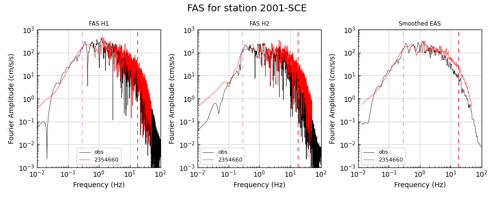

## plot_gmpe.py

The plot_gmpe.py module provides visualization capabilities for comparing ground motion predictions from Ground Motion Models (GMMs / GMPEs—Ground Motion Prediction Equations) against simulated or observed response spectra (Pseudo-Spectral Acceleration, PSA).

Here are the available command-line options:

```
usage: plot_gmpe.py [-h] --gmpe-dir GMPE_DIR [--comp-dir COMP_DIR] [--output-dir OUTPUT_DIR] [-o OUTPUT_FILE]
                    [--batch-file BATCH_FILE] [--station-id STATION_ID] [--station-list STATION_LIST]
                    [--plot-title PLOT_TITLE] [--comp-label COMP_LABEL]
                    [--run-prefix RUN_PREFIX] --gmpe-group GMPE_GROUP [-q]

Generate GMPE Comparison plots

options:
  -h, --help            show this help message and exit
  --gmpe-dir GMPE_DIR   input directory with GMPE data
  --comp-dir COMP_DIR   input directory with comparison files
  --output-dir OUTPUT_DIR
                        output directory
  -o, --output, --output-file OUTPUT_FILE
                        output plot file
  --batch-file, -b BATCH_FILE
                        file with list of timeseries to process
  --station-id, -id STATION_ID
                        station id
  --station-list, -s STATION_LIST
                        station list for batch processing
  --plot-title, --title PLOT_TITLE
                        plot title
  --comp-label COMP_LABEL
                        comparison label used for the output file prefix
  --run-prefix RUN_PREFIX
                        prefix to be added to the comparison files
  --gmpe-group GMPE_GROUP
                        GMPE group ['nga-west1', 'nga-west2', 'cena group 1']
  -q, --quiet           runs in quiet mode, only print error messages
```

The module can generate a plot for a single station, or go through a station list (or batch file) and generate individual plots for each of the stations. Users need to provide two folder where the GMPE data (--gmpe-dir) and the comparison data (--comp-dir) can be found, along with the desired GMPE group. The module expects the GMPE data to be in .ri50 format and the comparison data to be in .rd50 format (see the [File Format Guide](./File-Format-Guide.md) for more details).

When generating a plot for a single station, users will need to provide a station id and (optionally) an output file. If no output file is provided, the module will generate a plot using the <COMP_LABEL>_<RUN_PREFIX>_<STATION_ID>_gmpe.png format. When genreating plots for several stations, users can specify a station list, as in the example below:

```bash
$ plot_gmpe.py --gmpe-group nga-west2 --station-list nr_v19_06_2.stl --output-dir gmpe_plots_output --gmpe-dir gmpe_data_input --comp-dir obs_data --comp-label NR-GMPE
```

Here is how to generate the same plots using the Python API:
```python
# Import plot_gmpe module
from plots import plot_gmpe

# Set up inputs
station_file = "nr_v19_06_2.stl"
gmpe_group = "nga-west2"
comp_label = "NR-GMPE"
gmpe_dir = "gmpe_data_input"
comp_dir = "obs_data"
output_dir = "gmpe_plots_output"

# Generate plot
plot_gmpe.run_station_mode(station_file, gmpe_dir, comp_dir, output_dir, gmpe_group, comp_label, verbose=True)
```

And the figure below shows the result for one of the stations:

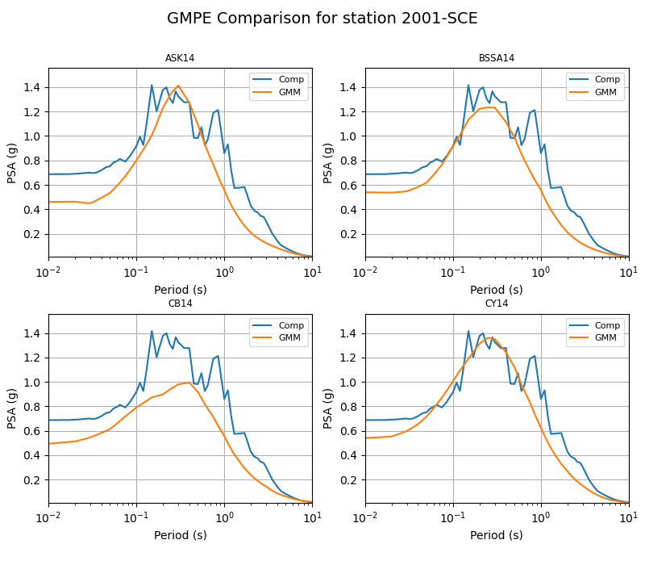

# PSA Goodness-of-Fit Plots

The PSA Goodness-of-Fit plots show the comparison of the PSA data from two different sources. They can be recorded data against simulated data, or two sets of simulated data.

## plot_psa_gof.py

The plot_psa_gof.py module plots the results calculated by the psa_gof.py module in the [stats package](./Statistics-Computation.md).

Here are the available command-line options:

```
usage: plot_psa_gof.py [-h] [--input-dir INPUT_DIR] [--output-dir OUTPUT_DIR] [-o OUTPUT_FILE]
                       --comp-label COMP_LABEL [--plot-mode PLOT_MODE] [--max-cutoff MAX_CUTOFF]
                       [--low-freq LFREQ] [--high-freq HFREQ] [--colorset COLORSET] [--plot-limit PLOT_LIMIT]
                       [--plot-title PLOT_TITLE] [-q]

Generates PSA comparison GoF plot.

options:
  -h, --help            show this help message and exit
  --input-dir INPUT_DIR
                        input directory with residuals files
  --output-dir OUTPUT_DIR
                        output directory
  -o, --output, --output-file OUTPUT_FILE
                        output rd100 file
  --comp-label COMP_LABEL
                        comparison label used for the output file prefix
  --plot-mode PLOT_MODE
                        plot mode [rd50, rd50-single, rd50-single-freq, rd100]
  --max-cutoff MAX_CUTOFF
                        select max cutoff distance (km) for the comparison
  --low-freq, --lf LFREQ
                        adds vertical line at this low frequency corner
  --high-freq, --hf HFREQ
                        adds vertical line at this high frequency corner
  --colorset COLORSET   select colorset [single/combined] default single
  --plot-limit PLOT_LIMIT
                        select GoF plot limit, default=0.01s
  --plot-title, --title PLOT_TITLE
                        select plot title for the GoF plot
  -q, --quiet           runs in quiet mode, only print error messages
```

The --comp-label argument should match what was used in the psa_gof.py module, and the --input-dir should specify where the output from that module can be located. Here is an example on how to call the plot_psa_gof.py module:

```bash
$ plot_psa_gof.py --comp-label NR_2354660 --max-cutoff 120 --plot-title "GoF Comparison between NR and simulation 2354660" --output-dir gof_plot_output --input-dir output_psa_data
```

The following Python code will generate the same GoF plot:

```python
# Import plot_psa_gof module
from plots import plot_psa_gof

# Set up inputs
max_cutoff = 120
comp_label = "NR_2354660"
plot_title = "GoF Comparison between NR and simulation 2354660"
input_dir = "output_psa_data"
output_dir = "gof_plot_output"

# Generate GoF plot
plot_psa_gof.plot_psa_gof(input_dir, output_dir, plot_title, comp_label, max_cutoff=max_cutoff, verbose=True)
```

The resulting Goodness-of-Fit (GoF) plot is shown below:

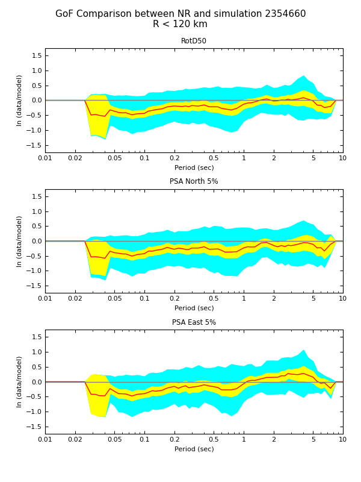

The top subplot shows the RotD50 comparison, while the bottom two subplots show the comparison of the two horizontal components.

## plot_dist_gof.py

The plot_dist_gof.py module plots the results calculated by the psa_gof.py module in the [stats package](./Statistics-Computation.md).

Here are the available command-line options:

```
usage: plot_dist_gof.py [-h] [--input-dir INPUT_DIR] [--output-dir OUTPUT_DIR] --comp-label COMP_LABEL
                        [--rotd100] [--rotd50] [--plot-title PLOT_TITLE] [-q]

Generates PSA distance comparison GoF plots.

options:
  -h, --help            show this help message and exit
  --input-dir INPUT_DIR
                        input directory
  --output-dir OUTPUT_DIR
                        output directory
  --comp-label COMP_LABEL
                        comparison label used for the output file prefix
  --rotd100             select RotD100 comparison
  --rotd50              select RotD50 comparison (default)
  --plot-title, --title PLOT_TITLE
                        set plot title
  -q, --quiet           runs in quiet mode, only print error messages
```

The --comp-label argument should match what was used in the psa_gof.py module, and the --input-dir should specify where the output from that module can be located. Here is an example on how to call the plot_dist_gof.py module:

```bash
$ plot_dist_gof.py --comp-label NR_2354660 --output-dir gof_plot_output --input-dir output_psa_data --rotd50 --plot-title "GoF Comparison between NR and simulation 2354660"
```

The following Python code will generate the same GoF plots:

```python
# Import plot_dist_gof module
from plots import plot_dist_gof

# Set up inputs
plot_mode = "rd50"
comp_label = "NR_2354660"
plot_title = "GoF Comparison between NR and simulation 2354660"
input_dir = "output_psa_data"
output_dir = "gof_plot_output"

# Generate GoF plots
plot_dist_gof.plot_dist_gof(input_dir, output_dir, comp_label, plot_mode, plot_title=plot_title, verbose=True)
```

The resulting Goodness-of-Fit (GoF) plots are shown below. Note that the plot_dist_gof.py module produces two separate plots with the same data: one using linear distance and another one using log.

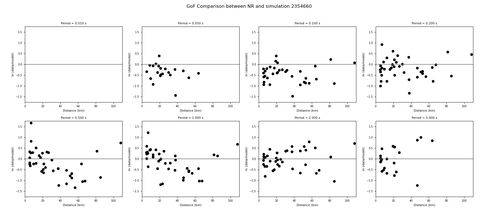

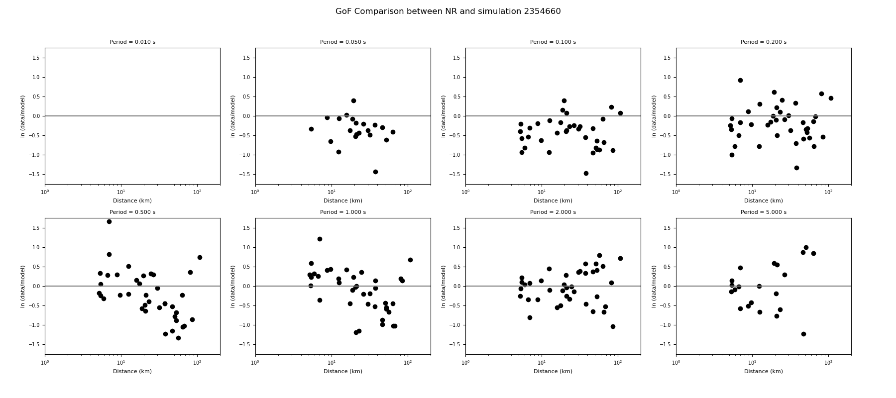

## plot_map_gof.py

The plot_map_gof.py module plots the results calculated by the psa_gof.py module in the [stats package](./Statistics-Computation.md).

Here are the available command-line options:

```
usage: plot_map_gof.py [-h] [--input-dir INPUT_DIR] [--output-dir OUTPUT_DIR] [--src-file SRC_FILE]
                       [--station-list STATION_LIST] --comp-label COMP_LABEL [--rotd100] [--rotd50]
                       [--plot-title PLOT_TITLE] [-q]

Generates PSA Vs30 comparison GoF plot.

options:
  -h, --help            show this help message and exit
  --input-dir INPUT_DIR
                        input directory
  --output-dir OUTPUT_DIR
                        output directory
  --src-file, --src SRC_FILE
                        source description file (SRC file)
  --station-list, -s STATION_LIST
                        station list
  --comp-label COMP_LABEL
                        comparison label used for the output file prefix
  --rotd100             select RotD100 comparison
  --rotd50              select RotD50 comparison (default)
  --plot-title, --title PLOT_TITLE
                        set plot title
  -q, --quiet           runs in quiet mode, only print error messages
```

The --comp-label argument should match what was used in the psa_gof.py module, and the --input-dir should specify where the output from that module can be located. Here is an example on how to call the plot_map_gof.py module:

```bash
$ plot_map_gof.py --comp-label NR_2354660 --output-dir gof_plot_output --input-dir output_psa_data --rotd50 --plot-title "GoF Comparison between NR and simulation 2354660" --src-file nr_v20_07_1.src --station-list nr_v19_06_2.stl
```

The following Python code will generate the same GoF plot:

```python
# Import plot_map_gof module
from plots import plot_map_gof

# Set up inputs
station_file = "nr_v19_06_2.stl"
src_file = "nr_v20_07_1.src"
plot_mode = "rd50"
comp_label = "NR_2354660"
plot_title = "GoF Comparison between NR and simulation 2354660"
input_dir = "output_psa_data"
output_dir = "gof_plot_output"

# Generate GoF plot
plot_map_gof.plot_map_gof(input_dir, output_dir, comp_label, plot_mode, src_file, station_file, plot_title=plot_title, verbose=True)
```

The resulting Goodness-of-Fit (GoF) plot is shown below:

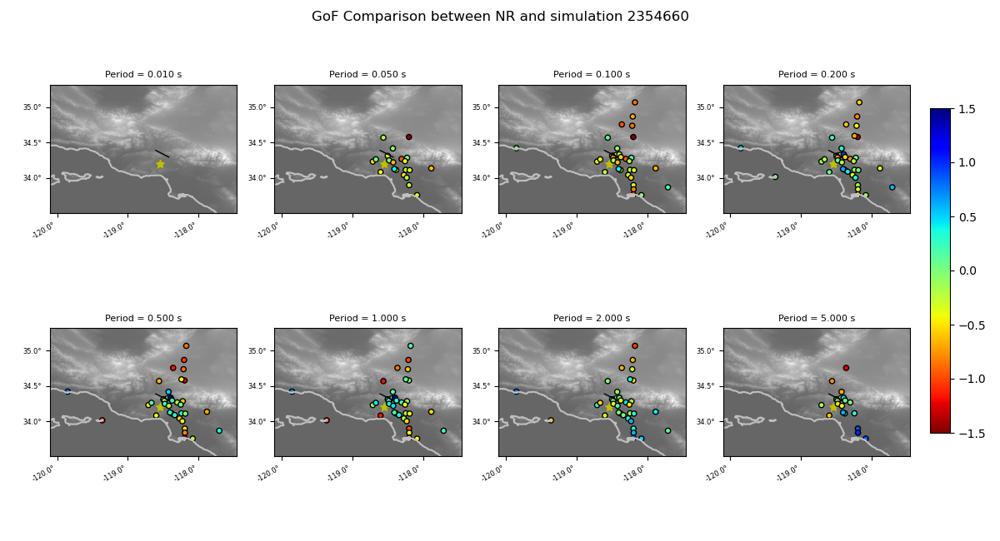

## plot_vs30_gof.py

The plot_vs30_gof.py module plots the results calculated by the psa_gof.py module in the [stats package](./Statistics-Computation.md).

Here are the available command-line options:

```
usage: plot_vs30_gof.py [-h] [--input-dir INPUT_DIR] [--output-dir OUTPUT_DIR] --comp-label COMP_LABEL
                        [--rotd100] [--rotd50] [--plot-title PLOT_TITLE] [-q]

Generates PSA Vs30 comparison GoF plot.

options:
  -h, --help            show this help message and exit
  --input-dir INPUT_DIR
                        input directory
  --output-dir OUTPUT_DIR
                        output directory
  --comp-label COMP_LABEL
                        comparison label used for the output file prefix
  --rotd100             select RotD100 comparison
  --rotd50              select RotD50 comparison (default)
  --plot-title, --title PLOT_TITLE
                        set plot title
  -q, --quiet           runs in quiet mode, only print error messages
```

The --comp-label argument should match what was used in the psa_gof.py module, and the --input-dir should specify where the output from that module can be located. Here is an example on how to call the plot_vs30_gof.py module:

```bash
$ plot_vs30_gof.py --comp-label NR_2354660 --output-dir gof_plot_output --input-dir output_psa_data --rotd50 --plot-title "GoF Comparison between NR and simulation 2354660"
```

The following Python code will generate the same GoF plot:

```python
# Import plot_vs30_gof module
from plots import plot_vs30_gof

# Set up inputs
station_file = "nr_v19_06_2.stl"
src_file = "nr_v20_07_1.src"
plot_mode = "rd50"
comp_label = "NR_2354660"
plot_title = "GoF Comparison between NR and simulation 2354660"
input_dir = "output_psa_data"
output_dir = "gof_plot_output"

# Generate GoF plot
plot_vs30_gof.plot_vs30_gof(input_dir, output_dir, comp_label, plot_mode, plot_title=plot_title, verbose=True)
```

The resulting Goodness-of-Fit (GoF) plot is shown below:

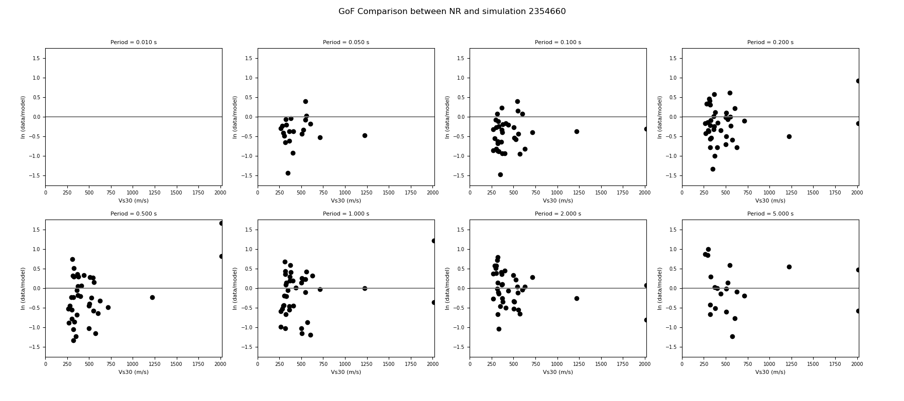

# FAS Goodness-of-Fit Plots

The FAS Goodness-of-Fit plots show the comparison of the FAS/EAS and FAS/SEAS data from two different sources. They can be recorded data against simulated data, or two sets of simulated data.

## plot_fas_eas_gof.py

The plot_fas_eas_gof.py module plots the results calculated by the fas_eas_gof.py module in the [stats package](./Statistics-Computation.md).

Here are the available command-line options:

```
usage: plot_fas_eas_gof.py [-h] [--input-dir INPUT_DIR] [--output-dir OUTPUT_DIR] --comp-label COMP_LABEL
                           [--max-cutoff MAX_CUTOFF] [--low-freq LFREQ] [--high-freq HFREQ] [--method METHOD]
                           [--colorset COLORSET] [--plot-limit PLOT_LIMIT] [--plot-title PLOT_TITLE] [-q]

Generates FAS EAS GoF comparison plot.

options:
  -h, --help            show this help message and exit
  --input-dir INPUT_DIR
                        input directory with residuals files
  --output-dir OUTPUT_DIR
                        output directory
  --comp-label COMP_LABEL
                        comparison label used for the output file prefix
  --max-cutoff MAX_CUTOFF
                        select max cutoff distance (km) for the comparison
  --low-freq, --lf LFREQ
                        adds vertical line at this low frequency corner
  --high-freq, --hf HFREQ
                        adds vertical line at this high frequency corner
  --method METHOD       specify simulation method (for both low and high freq lines)
  --colorset COLORSET   select colorset [single/combined] default single
  --plot-limit PLOT_LIMIT
                        select GoF plot limit, default=0.01s
  --plot-title, --title PLOT_TITLE
                        select plot title for the GoF plot
  -q, --quiet           runs in quiet mode, only print error messages
```

The --comp-label argument should match what was used in the fas_eas_gof.py module, and the --input-dir should specify where the output from that module can be located. Here is an example on how to call the plot_fas_eas_gof.py module:

```bash
$ plot_fas_eas_gof.py --comp-label NR_2354660 --max-cutoff 120 --method gp --input-dir output_fas_data --output-dir gof_plot_output
```

And this is how to generate the same plot using the Python API:

```python
# Import the plot_fas_eas_gof module
from plots import plot_fas_eas_gof

# Set up inputs
comp_label = "NR_2354660"
max_cutoff = 120
method = "gp"
input_dir = "output_fas_data"
output_dir = "gof_plot_output"

# Generate plot
plot_fas_eas_gof.plot_fas_eas_gof(plot_title, comp_label, input_dir, output_dir, max_cutoff=max_cutoff, method=met\
hod, verbose=True)
```

The resulting Goodness-of-Fit (GoF) plot is shown below:

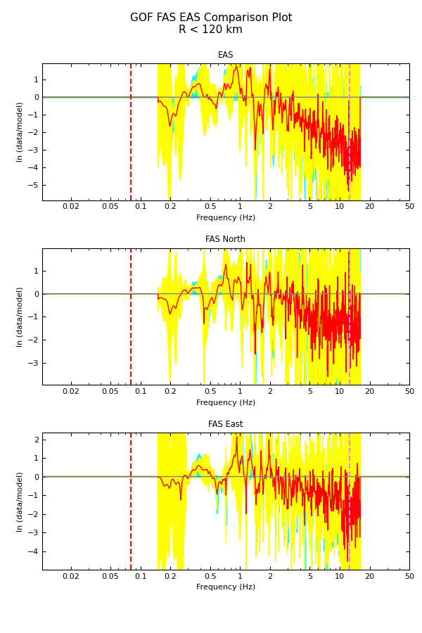

## plot_fas_seas_gof.py

The plot_fas_seas_gof.py module plots the results calculated by the fas_seas_gof.py module in the [stats package](./Statistics-Computation.md).

Here are the available command-line options:

```
usage: plot_fas_seas_gof.py [-h] [--input-dir INPUT_DIR] [--output-dir OUTPUT_DIR] --comp-label COMP_LABEL
                            [--max-cutoff MAX_CUTOFF] [--low-freq LFREQ] [--high-freq HFREQ] [--method METHOD]
                            [--colorset COLORSET] [--plot-limit PLOT_LIMIT] [--plot-title PLOT_TITLE] [-q]

Generates FAS SEAS GoF comparison plot.

options:
  -h, --help            show this help message and exit
  --input-dir INPUT_DIR
                        input directory with residuals files
  --output-dir OUTPUT_DIR
                        output directory
  --comp-label COMP_LABEL
                        comparison label used for the output file prefix
  --max-cutoff MAX_CUTOFF
                        select max cutoff distance (km) for the comparison
  --low-freq, --lf LFREQ
                        adds vertical line at this low frequency corner
  --high-freq, --hf HFREQ
                        adds vertical line at this high frequency corner
  --method METHOD       specify simulation method (for both low and high freq lines)
  --colorset COLORSET   select colorset [single/combined] default single
  --plot-limit PLOT_LIMIT
                        select GoF plot limit, default=0.01s
  --plot-title, --title PLOT_TITLE
                        select plot title for the GoF plot
  -q, --quiet           runs in quiet mode, only print error messages
```

The --comp-label argument should match what was used in the fas_seas_gof.py module, and the --input-dir should specify where the output from that module can be located. Here is an example on how to call the plot_fas_seas_gof.py module:

```bash
$ plot_fas_seas_gof.py --comp-label NR_2354660 --max-cutoff 120 --method gp --input-dir output_fas_data --output-dir gof_plot_output
```

And this is how to generate the same plot using the Python API:

```python
# Import the plot_fas_seas_gof module
from plots import plot_fas_seas_gof

# Set up inputs
comp_label = "NR_2354660"
max_cutoff = 120
method = "gp"
input_dir = "output_fas_data"
output_dir = "gof_plot_output"

# Generate plot
plot_fas_seas_gof.plot_fas_seas_gof(plot_title, comp_label, input_dir, output_dir, max_cutoff=max_cutoff, method=method, verbose=True)
```

The resulting Goodness-of-Fit (GoF) plot is shown below:

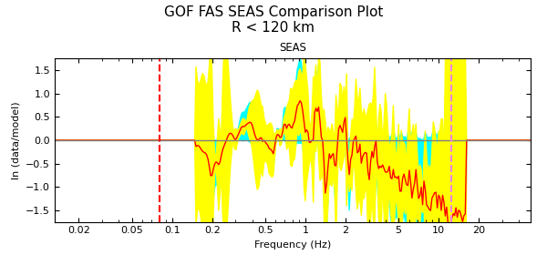

## GMPE Goodness-of-Fit Plots

## plot_gmpe_gof.py

The plot_gmpe_gof.py module plots the results calculated by the gmpe_gof.py module in the [stats package](./Statistics-Computation.md).

Here are the available command-line options:

```
usage: plot_gmpe_gof.py [-h] [--input-dir INPUT_DIR] [--output-dir OUTPUT_DIR] --comp-label COMP_LABEL
                        --gmpe-group GMPE_GROUP [--run-prefix RUN_PREFIX] --station-list STATION_LIST
                        [--plot-title PLOT_TITLE] [-q]

Generates GMPE GoF comparison plot.

options:
  -h, --help            show this help message and exit
  --input-dir INPUT_DIR
                        input directory with residuals files
  --output-dir OUTPUT_DIR
                        output directory
  --comp-label COMP_LABEL
                        comparison label used for the output file prefix
  --gmpe-group GMPE_GROUP
                        GMPE group ['nga-west1', 'nga-west2', 'cena group 1']
  --run-prefix RUN_PREFIX
                        prefix to be added to the comparison files
  --station-list, -s STATION_LIST
                        station list
  --plot-title, --title PLOT_TITLE
                        select plot title for the GoF plot
  -q, --quiet           runs in quiet mode, only print error messages
```

The --comp-label argument should match what was used in the gmpe_gof.py module, and the --input-dir should specify where the output from that module can be located. Here is an example on how to call the plot_gmpe_gof.py module:

```bash
$ plot_gmpe_gof.py --station-list nr_v19_06_2.stl --gmpe-group nga-west2 --output-dir gof_plot_output --input-dir output_gmpe_data --comp-label NR --run-prefix 2354660
```

And here is how to generate the same plot using the Python API:

```python
# Import the plot_gmpe_gof module
from plots import plot_gmpe_gof

# Set up inputs
station_file = "nr_v19_06_2.stl"
gmpe_group = "ga-west2"
comp_label = "NR"
run_prefix = "2354660"
plot_title = "GoF Comparison between GMMs and Northridge Data"

# Generate the GoF plot
plot_gmpe_gof.plot_gmpe_gof(station_file, gmpe_group, comp_label, plot_title, input_dir, output_dir, run_prefix=run_prefix, verbose=True)
```

The resulting Goodness-of-Fit (GoF) plot is shown below:

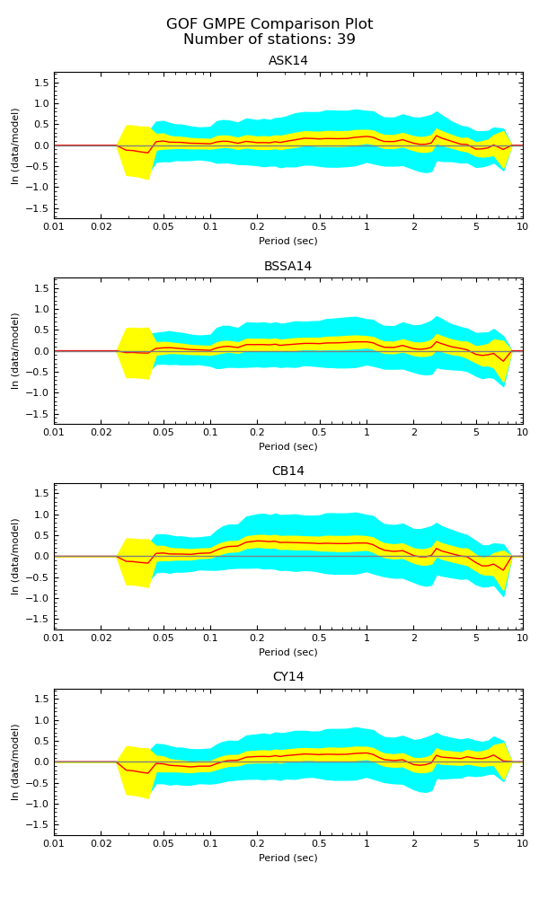