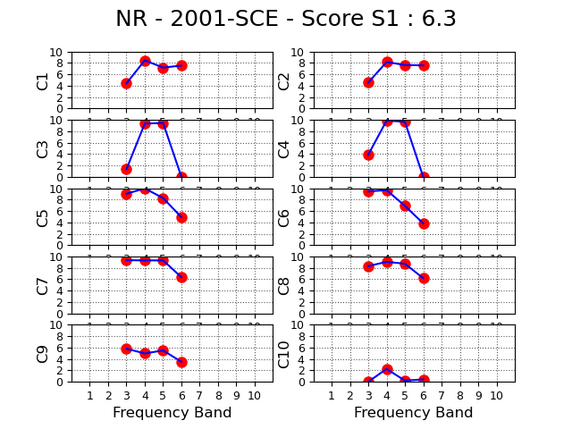
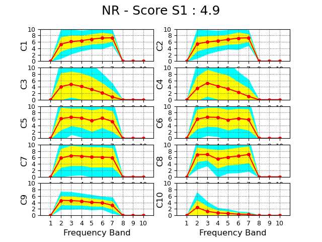

The GMSV Toolkit includes several tools from the Broadband Platform that can be used for computing statistics from data across several stations. The output of several of these tools can later be used to generate [Goodness-of-Fit (GoF) plots](./Plotting). Each tool supports both a command-line interface for individual file processing and programmatic integration via a Python API.

## psa_gof.py

The 'psa_gof.py' script can be used to calculate Pseudo-Spectral Acceleration (PSA) Goodness-of-Fit (GoF) by comparing simulated ground motion spectral accelerations against recorded/observed ground motions across multiple stations and frequencies.

The script computes residual metrics across discrete periods/frequencies, allowing researchers and engineers to quantify how well a ground motion simulation model reproduces observed earthquake spectral accelerations.

The following command-line options are available:

```
usage: psa_gof.py [-h] [--sims-dir SIMS_DIR] [--obs-dir OBS_DIR] [--output-dir OUTPUT_DIR] [--src-file SRC_FILE]
                  [--station-list STATION_LIST] [--comp-label COMP_LABEL] [--rotd100] [--rotd50]
                  [--max-cutoff MAX_CUTOFF] [-q]

Generates PSA comparison files needed to create PSA GoF.

options:
  -h, --help            show this help message and exit
  --sims-dir SIMS_DIR   input directory with simulation data
  --obs-dir OBS_DIR     input directory with observed data
  --output-dir OUTPUT_DIR
                        output directory
  --src-file, --src SRC_FILE
                        source description file (SRC file)
  --station-list, -s STATION_LIST
                        station list
  --comp-label COMP_LABEL
                        comparison label used for the output file prefix
  --rotd100             select RotD100 comparison
  --rotd50              select RotD50 comparison (default)
  --max-cutoff MAX_CUTOFF
                        select max cutoff distance (km) for the comparison
  -q, --quiet           runs in quiet mode, only print error messages
```

The command below will aggregate RotD50 data from all stations in the station list. It will look for two sets of data, simulated data in the bbp_results folder, and recorded data in the obs_data directory. The max-cutoff flag is used to limit the comparison to stations closer than (in this case) 120km from the rupture.

```bash
$ psa_gof.py --max-cutoff 120 --comp-label NR_2354660 --src-file nr_v20_07_1.src --station-list nr_v19_06_2.stl --output-dir output_psa_data --obs-dir obs_data --sims-dir bbp_results
```

And here is the corresponding Python API code:

```python
# Import psa_gof module and initialize object
from stats import psa_gof
psa_gof_obj = psa_gof.PSAGoF(mode="rotd50", max_cutoff=120, comp_label="NR_2354660")

# Set up inputs
station_file = "nr_v19_06_2.stl"
src_file = "nr_v20_07_1.src"
obs_dir = "obs_data"
sims_dir = "bbp_results"
output_dir = "output_psa_data"

# Run the GoF method
psa_gof_obj.run_psa_gof(station_file, src_file, obs_dir, sims_dir, output_dir, verbose=True)
```

## fas_eas_gof.py

The fas_eas_gof.py script evaluates Goodness-of-Fit (GoF) metrics by comparing Fourier Amplitude Spectra (FAS) and Effective Amplitude Spectra (EAS) between simulated seismograms and target observations.

The script computes residual metrics across discrete frequency points, generating standard SCEC Broadband Platform (BBP) compatible residual files (bias, standard deviations, and 90% confidence intervals), which can later be plotted using the plot_fas_eas_gof.py module in the [plots package](./Plotting).

The following command-line options are available:

```
usage: fas_eas_gof.py [-h] [--sim-dir SIM_DIR] [--obs-dir OBS_DIR] [--output-dir OUTPUT_DIR]
                      [--src-file SRC_FILE] [--station-list STATION_LIST] [--comp-label COMP_LABEL]
                      [--max-cutoff MAX_CUTOFF] [--acc-dir ACC_DIR] [--acc-prefix ACC_PREFIX]
                      [--acc-suffix ACC_SUFFIX] [--obs-prefix OBS_PREFIX] [--sim-prefix SIM_PREFIX] [-q]

Generates FAS comparison files needed to create FAS GoF.

options:
  -h, --help            show this help message and exit
  --sim-dir SIM_DIR     input directory with FAS EAS files
  --obs-dir OBS_DIR     input directory with FAS EAS files
  --output-dir OUTPUT_DIR
                        output directory
  --src-file, --src SRC_FILE
                        source description file (SRC file)
  --station-list, -s STATION_LIST
                        station list
  --comp-label COMP_LABEL
                        comparison label used for the output file prefix
  --max-cutoff MAX_CUTOFF
                        select max cutoff distance (km) for the comparison
  --acc-dir ACC_DIR     input directory with acc seismograms
  --acc-prefix ACC_PREFIX
                        prefix for acc seismograms (default is no prefix)
  --acc-suffix ACC_SUFFIX
                        suffix for acc seismograms (default .acc.bbp)
  --obs-prefix OBS_PREFIX
                        prefix for observation EAS FAS files
  --sim-prefix SIM_PREFIX
                        prefix for simulation EAS FAS files
  -q, --quiet           runs in quiet mode, only print error messages
```

For example, the following command below will aggregate FAS/EAS data (generated by the fas.py module in the [metrics package](./Metrics-Calculation)) from all stations in the station list. It will look for two sets of data, simulated data and recorded data (both in the fas_output folder). In order to match the different files, users can specify prefixes for the simulated and observed data via the correponding command-line options. The max-cutoff flag is used to limit the comparison to stations closer than (in this case) 120km from the rupture. 

```bash
$ fas_eas_gof.py --station-list nr_v19_06_2.stl --src-file nr_v20_07_1.src --max-cutoff 120 --comp-label NR_2354660 --output-dir output_fas_data --sim-dir fas_output --obs-dir fas_output --sim-prefix 2354660 --obs-prefix obs
```

And here is the corresponding Python API code:

```python
# Import fas_eas_gof module and initialize object
from stats import fas_eas_gof
fas_eas_gof_obj = fas_eas_gof.FASEASGoF(comp_label="NR_2354660", max_cutoff=120)

# Set up inputs
station_file = "nr_v19_06_2.stl"
src_file = "nr_v20_07_1.src"
obs_dir = "fas_output"
obs_prefix = "obs"
sims_dir = "fas_output"
sims_prefix = "2354660"
output_dir = "output_fas_data"

# Run FAS/EAS GoF
fas_eas_gof_obj.run_fas_eas_gof(station_file, src_file, obs_dir, sims_dir, output_dir, sim_prefix=sims_prefix, obs_prefix=obs_prefix, verbose=True)
```

## fas_seas_gof.py

The fas_seas_gof.py script evaluates Goodness-of-Fit (GoF) metrics by comparing Fourier Amplitude Spectra (FAS) and Smoothed Effective Amplitude Spectra (SEAS) between simulated seismograms and target observations.

The script computes residual metrics across discrete frequency points, generating standard SCEC Broadband Platform (BBP) compatible residual files (bias, standard deviations, and 90% confidence intervals), which can later be plotted using the plot_fas_seas_gof.py module in the [plots package](./Plotting).

The following command-line options are available:

```
usage: fas_seas_gof.py [-h] [--sim-dir SIM_DIR] [--obs-dir OBS_DIR] [--output-dir OUTPUT_DIR]
                       [--src-file SRC_FILE] [--station-list STATION_LIST] [--comp-label COMP_LABEL]
                       [--max-cutoff MAX_CUTOFF] [--acc-dir ACC_DIR] [--acc-prefix ACC_PREFIX]
                       [--acc-suffix ACC_SUFFIX] [--obs-prefix OBS_PREFIX] [--sim-prefix SIM_PREFIX] [-q]

Generates FAS comparison files needed to create FAS GoF.

options:
  -h, --help            show this help message and exit
  --sim-dir SIM_DIR     input directory with FAS SEAS files
  --obs-dir OBS_DIR     input directory with FAS SEAS files
  --output-dir OUTPUT_DIR
                        output directory
  --src-file, --src SRC_FILE
                        source description file (SRC file)
  --station-list, -s STATION_LIST
                        station list
  --comp-label COMP_LABEL
                        comparison label used for the output file prefix
  --max-cutoff MAX_CUTOFF
                        select max cutoff distance (km) for the comparison
  --acc-dir ACC_DIR     input directory with acc seismograms
  --acc-prefix ACC_PREFIX
                        prefix for acc seismograms (default is no prefix)
  --acc-suffix ACC_SUFFIX
                        suffix for acc seismograms (default .acc.bbp)
  --obs-prefix OBS_PREFIX
                        prefix for observation SEAS FAS files
  --sim-prefix SIM_PREFIX
                        prefix for simulation SEAS FAS files
  -q, --quiet           runs in quiet mode, only print error messages
```

For example, the following command below will aggregate FAS/SEAS data (generated by the fas.py module in the [metrics package](./Metrics-Calculation)) from all stations in the station list. It will look for two sets of data, simulated data and recorded data (both in the fas_output folder). In order to match the different files, users can specify prefixes for the simulated and observed data via the correponding command-line options. The max-cutoff flag is used to limit the comparison to stations closer than (in this case) 120km from the rupture. 

```bash
$ fas_seas_gof.py --station-list nr_v19_06_2.stl --src-file nr_v20_07_1.src --max-cutoff 120 --comp-label NR_2354660 --output-dir output_fas_data --sim-dir fas_output --obs-dir fas_output --sim-prefix 2354660 --obs-prefix obs
```

And here is the corresponding Python API code:

```python
# Import fas_seas_gof module and initialize object
from stats import fas_seas_gof
fas_seas_gof_obj = fas_seas_gof.FASSEASGoF(comp_label="NR_2354660", max_cutoff=120)

# Set up inputs
station_file = "nr_v19_06_2.stl"
src_file = "nr_v20_07_1.src"
obs_dir = "fas_output"
obs_prefix = "obs"
sims_dir = "fas_output"
sims_prefix = "2354660"
output_dir = "output_fas_data"

# Run FAS/EAS GoF
fas_seas_gof_obj.run_fas_seas_gof(station_file, src_file, obs_dir, sims_dir, output_dir, sim_prefix=sims_prefix, obs_prefix=obs_prefix, verbose=True)
```

## gmpe_gof.py

The gmpe_gof.py module is used to calculate Goodness-of-Fit (GoF) metrics between observed (or simulated) ground motions and predictions from Ground Motion Prediction Equations (GMPEs / Ground Motion Models).  It compares response spectra intensity measures (such as RotD50 pseudo-spectral acceleration) derived from seismograms against expected attenuation relationship values (e.g., NGA-West2 models).

The output residual files log the calculated mean bias, standard deviation ($\sigma$), and confidence limits across predefined periods, which can later be plotted using plots/plot_gmpe_gof.py. 

The following command-line options are available:

```
usage: gmpe_gof.py [-h] --gmpe-dir GMPE_DIR --comp-dir COMP_DIR [--output-dir OUTPUT_DIR] --src-file SRC_FILE
                   --station-list STATION_LIST --comp-label COMP_LABEL [--run-prefix RUN_PREFIX]
                   --gmpe-group GMPE_GROUP [-q]

Generates PSA comparison files needed to create GMPE GoF.

options:
  -h, --help            show this help message and exit
  --gmpe-dir GMPE_DIR   input directory with GMPE data
  --comp-dir COMP_DIR   input directory with comparison files
  --output-dir OUTPUT_DIR
                        output directory
  --src-file, --src SRC_FILE
                        source description file (SRC file)
  --station-list, -s STATION_LIST
                        station list
  --comp-label COMP_LABEL
                        comparison label used for the output file prefix
  --run-prefix RUN_PREFIX
                        prefix to be added to the comparison files
  --gmpe-group GMPE_GROUP
                        GMPE group ['nga-west1', 'nga-west2', 'cena group 1']
  -q, --quiet           runs in quiet mode, only print error messages
```

For example, the following command below will aggregate GMPE data (generated by the metrics/calc_gmpe.py module) from all stations in the station list. It will look for two sets of data, GMPE data (located in the gmpe_data directory) and recorded data (.rd50 files, generated by the metrics/rotdxx.py script, in the obs_data folder). 

```bash
$ gmpe_gof.py --gmpe-dir gmpe_data --gmpe-group nga-west2 --station-list nr_v19_06_2.stl --src-file nr_v20_07_1.src --output-dir output_gmpe_data --comp-dir obs_data --comp-label NR --run-prefix 2354660
```

And here is the corresponding Python API code:

```python
# Import the gmpe_gof module
from stats import gmpe_gof
gmpe_gof_obj = gmpe_gof.GMPEGoF(comp_label="NR", run_prefix="2354660", gmpe_group_name="nga-west2")

# Set up inputs
station_file = "nr_v19_06_2.stl"
src_file = "nr_v20_07_1.src"
gmpe_dir = "gmpe_data"
comp_dir = "obs_data"
output_dir = "output_gmpe_data"

# Run the GMPE GoF
gmpe_gof_obj.run_gmpe_gof(station_file, src_file, gmpe_dir, comp_dir, output_dir, verbose=True)
```

## anderson_gof.py

The anderson_gof.py module in the SCEC Ground Motion Simulation Verification Toolkit calculates Goodness-of-Fit (GoF) metrics based on John Anderson’s 2004 criteria. It evaluates how closely simulated earthquake ground-motion time series match observed recordings (or reference seismograms) across ten key ground-motion characteristics.

The script implements the Anderson (2004) quantitative evaluation method. The comparison computes scores on a scale from 0 to 10 (or 0–100) across ten criteria:

* S1: Arias Intensity ($I_A$)
* S2: Energy Integral
* S3: Peak Acceleration (PGA)
* S4: Peak Velocity (PGV)
* S5: Peak Displacement (PGD)
* S6: Response Spectrum (PSA)
* S7: Fourier Amplitude Spectrum (FAS)
* S8: Duration of strong motion
* S9: Cross-correlation of waveforms
* S10: Cumulative Arias Intensity progression shape

Scores are typically computed across different frequency bands (e.g., broad-band, low-frequency, high-frequency) to provide fine-grained verification of simulation quality. 

The following command-line options are available:

```
usage: anderson_gof.py [-h] --obs-dir OBS_DIR --comp-dir COMP_DIR [--output-dir OUTPUT_DIR]
                       --station-list STATION_LIST --comp-label COMP_LABEL [--run-prefix RUN_PREFIX] [-q]

Generates the Anderson GoF comparison between two sets of seismograms.

options:
  -h, --help            show this help message and exit
  --obs-dir OBS_DIR     input directory with observation data
  --comp-dir COMP_DIR   input directory with comparison files
  --output-dir OUTPUT_DIR
                        output directory
  --station-list, -s STATION_LIST
                        station list
  --comp-label COMP_LABEL
                        comparison label used for the output file prefix
  --run-prefix RUN_PREFIX
                        prefix to be added to the comparison files
  -q, --quiet           runs in quiet mode, only print error messages
```

For example, to create a comparison of simulated data (located in the bbp_results directory) against recorded ground motions (located in the obs_data folder), we can use the following command:

```bash
$ anderson_gof.py --station-list bbp_inputs/nr_v19_06_2.stl --output-dir output_anderson_data --comp-dir bbp_results --obs-dir obs_data --comp-label NR
```

Below is an example on how to create the same comparison using the Python API:

```python
# Import the anderson_gof module
from stats import anderson_gof

# Set up inputs
station_file = "nr_v19_06_2.stl"
obs_dir = "obs_data"
comp_dir = "bbp_results"
output_dir = "output_anderson_data"

# Create and initialize the AndersonGOF object
anderson_gof_obj = anderson_gof.AndersonGOF(station_file, "NR")
anderson_gof_obj.run_anderson_gof(obs_dir, comp_dir, output_dir, verbose=True)

```

The module will produce per-station plots (first plot below) and summary files (csv file containing the information on the plot), as well as an overall comparison summary and plot (second figure below) where data from all stations is aggregated.




